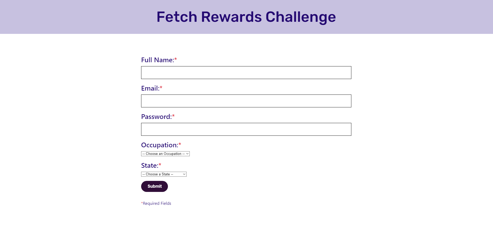
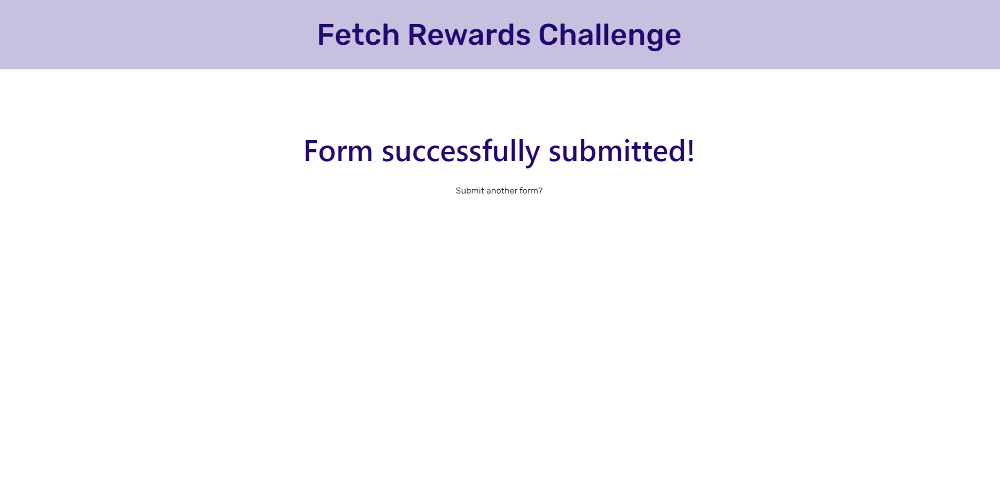

# Fetch Rewards Challenge

## Installation
To install dependencies, verify you are in the project root and run npm install

To start up the React app, from the project root directory, run 'npm start'

## Project Summary
A simple user form built with React and CSS.  

* Displays a form with multiple types of inputs
* Users can complete and submit the form
* Form has validation that checks for faulty submissions
* Users are redirected to a success page upon successful form submission

## Deployed Application
[Fetch Rewards Challenge](https://fetch-rewards-challenge.vercel.app)

## Technologies and Tools
* JavaScript
* React
* React Router
* Node
* CSS
* Vercel for deployment

## API Documentation
A 'GET' request sent to https://frontend-take-home.fetchrewards.com/form will return data in the form of -
```{
    "occupations": [
        "occupation1",
        "occupation2",
        ...
    ],
    "states": [
        {
            "name": "Alabama",
            "abbreviation": "AL"
        },
        ...
    ]
}```

A 'POST' request sent to the same endpoint must be formatted like -
```{
    "name": "???",
    "email": "???",
    "password": "???",
    "occupation": "???",
    "state": "???"
}```

### Home Page


### Success Page

